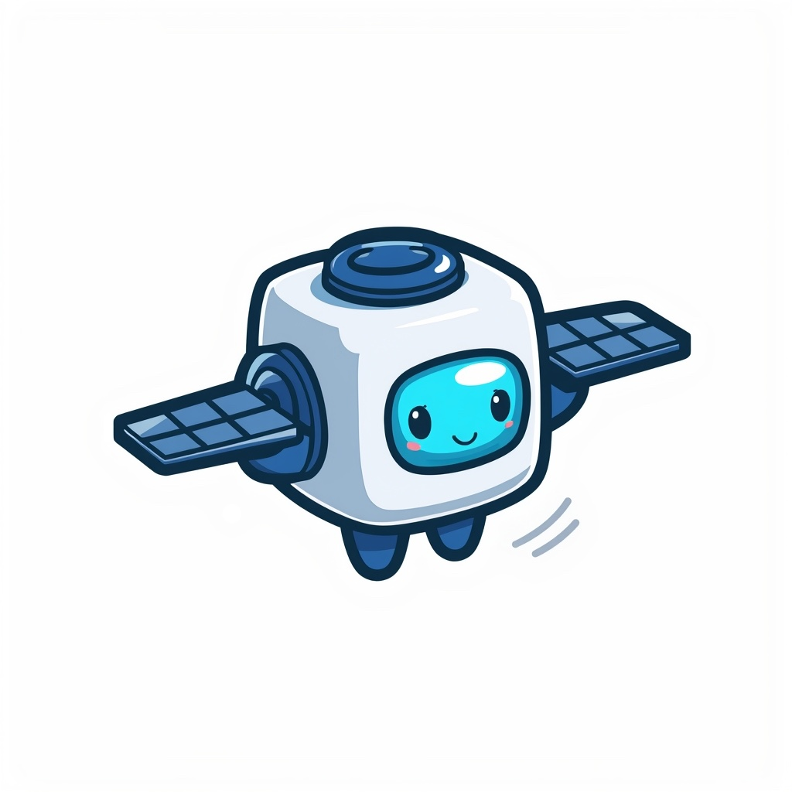

<p align="center">
  
</p>

# openbob

**An isolated agent runner for messaging platforms.** Inspired by [NanoClaw](https://github.com/qwibitai/nanoclaw) — each chat group gets its own sandboxed AI agent in a dedicated Docker container, with [OpenCode](https://opencode.ai) as the agent runtime and [OpenViking](https://github.com/volcengine/OpenViking) as persistent context memory.

**~5,000 lines of TypeScript. That's the entire thing.** No framework maze, no abstraction layers — just a single Node.js process orchestrating Docker containers. Read it in an afternoon, fork it, make it yours.

> **⚠️ Work in progress.** This project has not been thoroughly audited. While the architecture is designed with isolation in mind, use it at your own risk.

### Why openbob?

Most agent setups share a single process, a single context window, and a single filesystem. openbob takes a different approach:

- **Full container isolation** — Every group/channel gets its own Docker container with a dedicated workspace, session history, and filesystem. Agents can't see or interfere with each other. The host machine stays untouched.
- **[OpenCode](https://opencode.ai) as agent runtime** — The open-source AI coding agent (140K+ GitHub stars, 75+ LLM providers) runs inside each container as a headless server. It handles the LLM agent loop, tool execution, LSP integration, and session persistence — openbob just orchestrates.
- **[OpenViking](https://github.com/volcengine/OpenViking) as context memory** _(optional)_ — OpenViking is a context database that replaces flat vector stores with a filesystem paradigm. Agents build up structured, hierarchical memory across sessions — resources, skills, and learnings organized as a virtual filesystem (`viking://`) with tiered loading (L0 abstract → L1 overview → L2 full content). The agent gets smarter with use.

### How It Works

Here's what happens when someone sends `@openbob what did we decide about the API auth?` in a Telegram group:

```
 ┌─ Telegram ──────────────────────────────────────────────────────────┐
 │  User: "@openbob what did we decide about the API auth?"           │
 └──────────────────────────────────┬──────────────────────────────────┘
                                    │
 ┌─ Host (Node.js) ────────────────▼──────────────────────────────────┐
 │                                                                     │
 │  1. Poll new messages from Telegram                                 │
 │  2. Detect trigger word "@openbob" → route to group                 │
 │  3. Queue message (per-group concurrency control)                   │
 │                                                                     │
 │  ┌─ OpenViking (optional) ────────────────────────────────────┐     │
 │  │  4. Search memories for this prompt:                       │     │
 │  │     POST /search/find → viking://user/<id>/memories        │     │
 │  │     ← "In session #42, the team decided on JWT with        │     │
 │  │        refresh tokens for API auth (2024-03-15)"           │     │
 │  └────────────────────────────────────────────────────────────┘     │
 │                                                                     │
 │  5. Assemble prompt + inject recalled memories                      │
 │  6. Send to agent container via OpenCode SDK                        │
 │                                                                     │
 └──────────────────────────────────┬──────────────────────────────────┘
                                    │
 ┌─ Docker Container (per group) ──▼──────────────────────────────────┐
 │                                                                     │
 │  7. OpenCode server (port 4096) receives prompt                     │
 │  8. LLM agent loop: reasoning, tool calls, file access              │
 │  9. Agent can call MCP tools (send_message, schedule_task, ...)     │
 │     → writes JSON to /workspace/ipc/ → host picks up immediately    │
 │                                                                     │
 └──────────────────────────────────┬──────────────────────────────────┘
                                    │
 ┌─ Host ──────────────────────────▼──────────────────────────────────┐
 │                                                                     │
 │  10. Poll OpenCode session until complete                           │
 │  11. Collect agent response                                         │
 │                                                                     │
 │  ┌─ OpenViking (optional) ────────────────────────────────────┐     │
 │  │  12. Store conversation turn in session                    │     │
 │  │  13. Commit session → OpenViking extracts new memories:    │     │
 │  │      "Team decided on JWT + refresh tokens for API auth"   │     │
 │  │      → viking://user/<id>/memories/api-decisions           │     │
 │  └────────────────────────────────────────────────────────────┘     │
 │                                                                     │
 │  14. Format response, strip internal tags                           │
 │  15. Send reply to Telegram                                         │
 │                                                                     │
 └─────────────────────────────────────────────────────────────────────┘
```

The host manages all OpenViking communication — the agent itself doesn't need to know about it. Memories are recalled before each prompt and extracted after each response, so the agent gets smarter over time without any extra effort.

## Features

- **Multi-channel messaging** — Supports Telegram and Matrix. Architecture is extensible via channel registry.
- **Isolated group context** — Each group gets its own Docker container, workspace, `opencode.json` config, and session history.
- **Main channel** — A privileged admin channel that can register new groups and manage the system.
- **Scheduled tasks** — Cron, interval, or one-shot tasks that spin up the agent and can message results back.
- **Web access** — Agents have Chromium and `agent-browser` CLI for browsing, screenshots, and web interaction.
- **Per-group model override** — Different groups can use different LLM models.
- **MCP tools** — Agents have access to custom tools (send messages, schedule tasks, manage groups) via the Model Context Protocol.
- **Skills** — Read-only skill packs mounted into containers (e.g., `agent-browser`, `status`).
- **Voice transcription** (optional) — Transcribes voice messages to text using NVIDIA Parakeet TDT. CPU-only, no GPU required.
- **OpenViking memory** (optional) — Semantic recall and storage across sessions. Agents build up knowledge over time.

## Quick Start

### Prerequisites

- Docker + Docker Compose
- A messaging platform: **Telegram bot** (token from [@BotFather](https://t.me/BotFather)) or **Matrix** homeserver with a bot account
- LLM provider credentials — openbob uses OpenCode's `auth.json` file (see [Authentication](#authentication))

### Setup

```bash
git clone https://github.com/your-username/openbob.git
cd openbob
cp .env.example .env
```

Edit `.env` with your configuration:

```bash
# Absolute path on the host machine for persistent data
DATA_PATH=/opt/openbob/data

# LLM model — format: providerID/modelID
MODEL=anthropic/claude-sonnet-4-6

# --- Channel: pick Telegram OR Matrix (or both) ---

# Telegram
TELEGRAM_BOT_TOKEN=your-bot-token

# Matrix
# MATRIX_HOMESERVER_URL=https://matrix.example.com
# MATRIX_ACCESS_TOKEN=your-access-token
```

### Initial Channel Setup

On first run, openbob needs at least one registered group to monitor. Set the `INITIAL_GROUP_*` env vars to bootstrap it — the channel type is detected automatically from the JID prefix (`tg:` → Telegram, `mx:` → Matrix).

**Step 1: Get your Chat ID**

Start openbob with the channel credentials set (e.g. `TELEGRAM_BOT_TOKEN`). Then:

- **Telegram**: Send `/chatid` to your bot in the target chat. It replies with the JID, e.g. `tg:-1001234567890`.
- **Matrix**: Use the room ID from your Matrix client (visible in room settings). Prefix it: `mx:!roomid:server`.

**Step 2: Configure the initial group**

Add to your `.env`:

```bash
# Telegram example
INITIAL_GROUP_JID=tg:-1001234567890
INITIAL_GROUP_TRIGGER=openbob

# Matrix example
# INITIAL_GROUP_JID=mx:!roomid:matrix.org
# INITIAL_GROUP_TRIGGER=openbob
```

Optional overrides (sensible defaults are applied):

```bash
INITIAL_GROUP_FOLDER=main          # workspace folder (default: "main")
INITIAL_GROUP_IS_MAIN=true         # admin privileges (default: true)
```

**Step 3: Restart** — the group is persisted to the database. After the first run, these env vars are ignored for that JID (it won't overwrite existing entries).

> Additional groups can be registered at runtime via the `register_group` MCP tool from the main channel's agent.

### Authentication

openbob uses OpenCode's file-based authentication. Instead of passing API keys as environment variables, you provide a single `auth.json` file that gets copied into each agent container.

**Step 1:** Authenticate with your LLM provider(s) locally using [OpenCode](https://opencode.ai):

```bash
# Run opencode locally and authenticate with your provider
opencode
```

This creates `~/.local/share/opencode/auth.json` with your credentials.

**Step 2:** Copy the auth file to your data directory:

```bash
mkdir -p ${DATA_PATH}/opencode
cp ~/.local/share/opencode/auth.json ${DATA_PATH}/opencode/auth.json
```

> **Required:** The host will refuse to start without this file. On startup it validates that `auth.json` exists and copies it into each agent container's OpenCode data directory.

### Start

```bash
docker compose build
docker compose up -d
```

To enable OpenViking memory:

```bash
docker compose --profile memory up -d
```

To enable voice transcription (Speech-to-Text):

```bash
docker compose --profile stt up -d
```

Profiles can be combined:

```bash
docker compose --profile memory --profile stt up -d
```

### First Message

In your configured channel, mention the trigger word:

```
@openbob hello, what can you do?
```

The agent will spin up a container, process the message, and respond in the channel.

## Architecture

### Host (`src/`)

Single Node.js process that orchestrates everything:

| File                   | Purpose                                               |
| ---------------------- | ----------------------------------------------------- |
| `index.ts`             | Main loop — startup, polling, message dispatch        |
| `container-runner.ts`  | Spawns/manages Docker containers, OpenCode SDK client |
| `channels/matrix.ts`   | Matrix channel adapter                                |
| `channels/telegram.ts` | Telegram channel adapter                              |
| `channels/registry.ts` | Channel self-registration                             |
| `router.ts`            | Message formatting, trigger detection, routing        |
| `group-queue.ts`       | Per-group message queue with concurrency control      |
| `task-scheduler.ts`    | Cron/interval/one-shot task execution                 |
| `ipc.ts`               | Filesystem IPC watcher (agent → host communication)   |
| `db.ts`                | SQLite — messages, groups, sessions, tasks, state     |
| `env.ts`               | Environment validation (zod)                          |

### STT Service (`stt/`)

Runs as a Docker Compose sidecar (profile `stt`):

| File            | Purpose                                                             |
| --------------- | ------------------------------------------------------------------- |
| `main.py`       | FastAPI service — `/transcribe` (multipart audio → text), `/health` |
| `Dockerfile`    | Python 3.11 slim + onnx-asr, libsndfile, ffmpeg                     |
| `entrypoint.sh` | Validates model files, starts uvicorn                               |

### Agent (`agent/`)

Runs inside each Docker container:

| File            | Purpose                                                            |
| --------------- | ------------------------------------------------------------------ |
| `index.ts`      | Starts OpenCode server on port 4096                                |
| `mcp-server.ts` | MCP tools: `send_message`, `schedule_task`, `register_group`, etc. |

### Container Workspace Layout

Each agent container has everything mounted under `/workspace`:

```
/workspace/
  opencode.json         ← base config from host (read-only: model, permissions)
  AGENTS.md             ← agent instructions (read-only)
  context.json          ← group context: chatJid, groupFolder, isMain (read-only)
  project/              ← agent working directory (CWD, read-write)
  │  ├── opencode.json  ← optional: agent-created overrides for base config
  │  └── AGENTS.md      ← optional: agent-created supplemental instructions
  data/
  │  ├── opencode/      ← OpenCode state (sessions, auth.json — copied by host)
  │  └── telegram/
  │       └── files/    ← downloaded photos & documents (read-only)
  skills/               ← skill packs (read-only)
  ipc/
     ├── messages/      ← agent → host: send messages
     ├── tasks/         ← agent → host: schedule/manage tasks
     └── input/         ← host → agent: response files
```

### Two-Tier Configuration

OpenCode discovers config files by walking up from the agent's CWD (`/workspace/project/`) to `/`. With the layout above, it finds two levels:

1. **Base config** (`/workspace/opencode.json`) — written fresh by the host before each session. Sets model, share mode, and default permissions. Read-only inside the container.
2. **Agent override** (`/workspace/project/opencode.json`) — optional, created by the agent itself. Higher priority — agents can add MCP tools, change permissions, or customize behavior without touching the base config.

Same mechanism applies to `AGENTS.md` — both levels are concatenated, so the agent can supplement its base instructions.

### Container Lifecycle

1. Host receives a message for a group
2. `getAgentContainer()` checks if a container exists or spawns a new one
3. `writeAuthConfig()` copies `auth.json` into the group's OpenCode data directory
4. `writeOpencodeConfig()` writes a fresh `opencode.json` with the group's model config (no merging with existing)
5. `context.json` is updated with the group's identity (`chatJid`, `groupFolder`, `isMain`)
6. Container starts, OpenCode server boots on port 4096
7. Host sends prompt via `client.session.promptAsync()`, polls for completion
8. Agent processes the prompt, can call MCP tools (send messages, schedule tasks) via filesystem IPC
9. Host collects the response and posts it to the channel
10. Container stays warm for subsequent messages

### Docker Network

All containers share the `openbob` Docker network. The host reaches agent containers by name (`openbob-agent-<group>`), no published ports needed.

```
┌─────────────────────────────────────────────┐
│ Docker network: openbob                     │
│                                             │
│  openbob-host ──HTTP──> openbob-agent-*     │
│       │                       │             │
│       │                  OpenCode :4096     │
│       │                       │             │
│       └──IPC (filesystem)─────┘             │
│                                             │
│  openbob-stt (optional, :8000)              │
│  openbob-openviking (optional, :1933)       │
└─────────────────────────────────────────────┘
```

## Configuration

### Environment Variables

| Variable                | Required  | Description                                                       |
| ----------------------- | --------- | ----------------------------------------------------------------- |
| `DATA_PATH`             | Yes       | Absolute host path for persistent data                            |
| `MODEL`                 | Yes       | Default model, e.g. `anthropic/claude-sonnet-4-6`                 |
| `TELEGRAM_BOT_TOKEN`    | Channel   | Telegram bot token (from @BotFather)                              |
| `MATRIX_HOMESERVER_URL` | Channel   | Matrix homeserver URL                                             |
| `MATRIX_ACCESS_TOKEN`   | Channel   | Matrix bot access token                                           |
| `INITIAL_GROUP_JID`     | First run | Channel JID — prefix determines channel (`tg:` / `mx:`)           |
| `INITIAL_GROUP_FOLDER`  | No        | Workspace folder name (default: `main`)                           |
| `INITIAL_GROUP_TRIGGER` | No        | Trigger word (default: assistant name)                            |
| `INITIAL_GROUP_IS_MAIN` | No        | `true` for admin channel (default: `true`)                        |
| `LOG_LEVEL`             | No        | `trace` / `debug` / `info` / `warn` / `error` (default: `info`)   |
| `AGENT_FORWARD_ENV`     | No        | Comma-separated env vars to forward to agent containers           |
| `AGENT_TIMEOUT`         | No        | Agent response timeout in ms (default: `480000` / 8 min)          |
| `AGENT_STARTUP_TIMEOUT` | No        | Container startup health-check timeout in ms (default: `30000`)   |
| `IDLE_TIMEOUT`          | No        | Stop containers after this idle duration in ms (default: never)   |
| `OPENVIKING_URL`        | No        | OpenViking API URL (default: `http://openviking:1933`)            |
| `OPENVIKING_API_KEY`    | No        | OpenViking root API key — required for `group` scope provisioning |
| `OPENVIKING_SCOPE`      | No        | `global` or `group` (default: `global`) — see below               |

> **Note:** LLM provider API keys are **not** configured via environment variables. Authentication is handled entirely through `auth.json` — see [Authentication](#authentication).

### Per-Group Model Override

Groups can use different models. Set the `model` field when registering a group (via MCP tool or database), and it overrides the global `MODEL` env var for that group.

### OpenViking Configuration

[OpenViking](https://github.com/volcengine/OpenViking) provides persistent semantic memory across agent sessions. It's optional — if `OPENVIKING_URL` is not set (or the service isn't running), agents work without memory.

**Scopes:**

| Scope    | How it works                                                                                                                                                                  |
| -------- | ----------------------------------------------------------------------------------------------------------------------------------------------------------------------------- |
| `global` | All groups share one OpenViking user. The host reads a shared user key from `${DATA_PATH}/ov_user.key`.                                                                       |
| `group`  | Each group gets its own OpenViking user, provisioned on first interaction via the Admin API. Requires `OPENVIKING_API_KEY`. Per-group keys are stored in the SQLite database. |

**Setup with `docker compose --profile memory`:**

The OpenViking service needs its own LLM access for embedding/extraction. Configure `OPENVIKING_LLM_KEY` in your `.env` file — this key is only used by OpenViking itself, not by agents.

### Speech-to-Text (STT)

openbob can automatically transcribe voice messages to text using [NVIDIA Parakeet TDT](https://huggingface.co/nvidia/parakeet-tdt-0.6b-v2) — a fast, accurate speech recognition model running on CPU via [onnx-asr](https://github.com/jianfch/onnx-asr). No GPU required.

**How it works:**

1. A user sends a voice message in Telegram or Matrix
2. The host downloads the audio and sends it to the STT sidecar container
3. The transcribed text appears immediately as a reply in the chat (`🎤 transcribed text`)
4. The message is stored as `[Voice: transcribed text]` and processed normally — including trigger detection, so voice messages can activate the agent

**Setup with `docker compose --profile stt`:**

No configuration needed. The STT service is auto-detected via health probe — if it's running, voice transcription is enabled; if not, voice messages are stored as `[Voice message]` placeholders.

On first startup, the ~600MB ONNX model is downloaded from HuggingFace and cached in `${DATA_PATH}/stt-models/`.

**Supported channels:**

| Channel  | Voice detection                                                 | Audio format |
| -------- | --------------------------------------------------------------- | ------------ |
| Telegram | `message:voice` events (voice recordings only, not audio files) | OGG/Opus     |
| Matrix   | `MsgType.Audio` with `org.matrix.msc3245.voice` property        | OGG/Opus     |

**Optional env var:**

| Variable    | Default                     | Description            |
| ----------- | --------------------------- | ---------------------- |
| `STT_MODEL` | `nemo-parakeet-tdt-0.6b-v3` | Parakeet model variant |

## MCP Servers

Agents get MCP tools from two sources:

### Built-in: `openbob` Server

Always present — hardcoded in `agent/src/index.ts` via `createOpencodeServer()`. Provides IPC tools for messaging, task scheduling, and group management. This server runs as a stdio child process inside each agent container.

| Tool                                         | Description                                   | Restriction                  |
| -------------------------------------------- | --------------------------------------------- | ---------------------------- |
| `send_message`                               | Send a message to the chat immediately        | Own group only (unless main) |
| `schedule_task`                              | Create cron/interval/one-shot scheduled tasks | Own group only (unless main) |
| `cancel_task` / `pause_task` / `resume_task` | Manage scheduled tasks                        | Own group only (unless main) |
| `list_tasks`                                 | List scheduled tasks (main sees all)          | —                            |
| `update_task`                                | Update an existing task's config              | Own group only (unless main) |
| `list_groups`                                | List registered groups (main sees all)        | —                            |
| `register_group`                             | Register a new channel/group                  | Main group only              |
| `update_group`                               | Update group config (trigger, model, JID)     | Main group only              |
| `delete_group`                               | Delete a group and stop its container         | Main group only              |

### Custom MCP Servers

Add MCP servers for all agents by editing `workspace/opencode.json` — the base config template:

```json
{
  "share": "disabled",
  "permission": {
    "edit": "allow",
    "bash": "allow"
  },
  "mcp": {
    "my-server": {
      "type": "local",
      "command": ["node", "/workspace/skills/my-server/index.js"]
    }
  }
}
```

The host reads this template, overlays the per-group `model`, and writes the result to each group's `opencode.json`. Any MCP servers defined here are available to every agent.

For per-group MCP servers, the agent can create its own `/workspace/project/opencode.json` override (see [Two-Tier Configuration](#two-tier-configuration)).

## Skills

Skills are read-only instruction packs mounted at `/workspace/skills` inside agent containers. Each skill has a `SKILL.md` file that teaches the agent a capability.

Built-in skills:

| Skill           | Description                                         |
| --------------- | --------------------------------------------------- |
| `agent-browser` | Web browsing via Chromium and `agent-browser` CLI   |
| `status`        | System status reporting (containers, health, tasks) |

## Development

```bash
# Install dependencies
npm install
cd agent && npm install && cd ..

# Type checking
npm run typecheck

# Linting
npm run lint

# Tests
npm test

# Dev mode (without Docker)
npm run dev

# Build
npm run build
docker compose build
```

### Project Structure

```
openbob/
├── src/                    # Host application
│   ├── channels/           # Channel adapters (Telegram, Matrix, ...)
│   ├── index.ts            # Orchestrator main loop
│   ├── container-runner.ts # Docker container management
│   ├── db.ts               # SQLite database
│   ├── ipc.ts              # Filesystem IPC
│   ├── router.ts           # Message routing
│   ├── group-queue.ts      # Concurrency control
│   └── task-scheduler.ts   # Scheduled task runner
├── agent/                  # Agent container code
│   └── src/
│       ├── index.ts        # OpenCode server startup
│       └── mcp-server.ts   # MCP tools for the agent
├── stt/                    # Speech-to-text sidecar
│   ├── main.py             # FastAPI STT service (Parakeet TDT)
│   ├── Dockerfile          # Python 3.11 + onnx-asr
│   └── entrypoint.sh       # Startup + model validation
├── workspace/
│   ├── AGENTS.md           # Agent instructions (mounted into containers)
│   └── opencode.json       # Base config template (model, permissions, MCP servers)
├── skills/                 # Skill packs (read-only in containers)
├── openviking/             # OpenViking config + Dockerfile
├── docker-compose.yml
├── Dockerfile              # Host container
└── agent/Dockerfile        # Agent container
```

## Credits

Loosely based on [NanoClaw](https://github.com/qwibitai/nanoclaw) by [Qwibit AI](https://github.com/qwibitai). openbob replaces the Claude Code agent runner with [OpenCode](https://opencode.ai) and adds optional [OpenViking](https://github.com/volcengine/OpenViking) semantic memory, making it provider-agnostic and independently extensible.

## License

MIT
